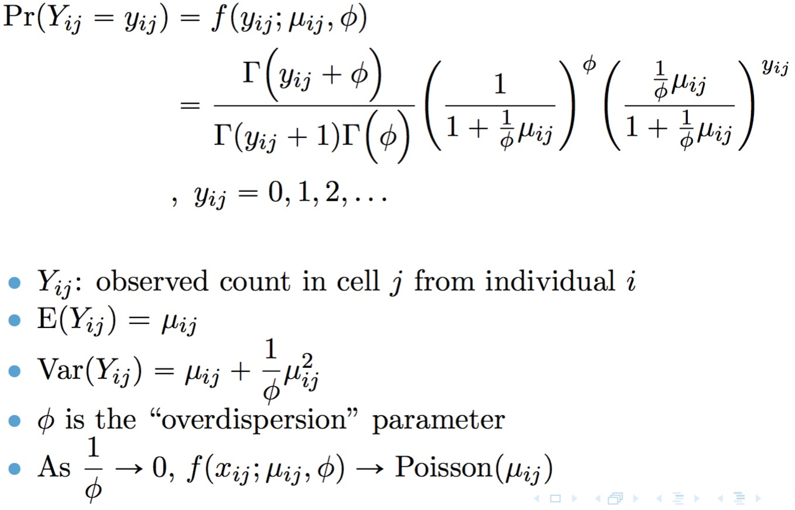
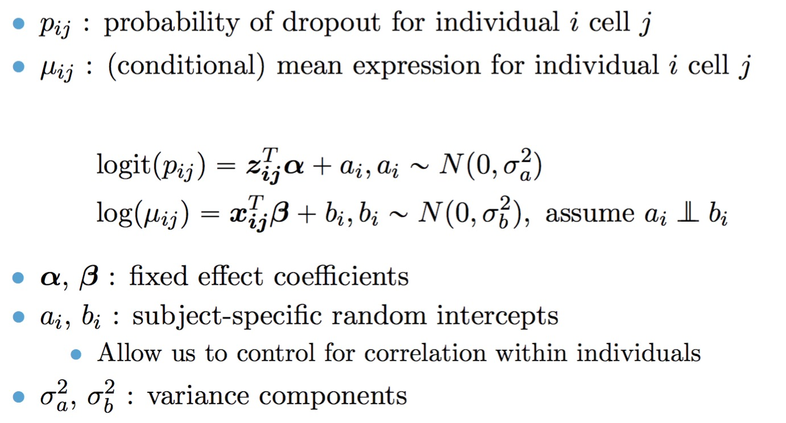

# TWO-SIGMA (TWO-component SInGle cell Model-based Association method) and TWO-SIGMA-G (TWO-SIGMA based Geneset Testing)

## Citations
**TWO-SIGMA**: 

Van Buren, E, Hu, M, Weng, C, et al. TWO‐SIGMA: A novel two‐component single cell model‐based association method for single‐cell RNA‐seq data. Genetic Epidemiology. 2020; 1– 12. https://doi.org/10.1002/gepi.22361

**TWO-SIGMA-G bioRxiv preprint**:

TWO-SIGMA-G: A New Competitive Gene Set Testing Framework for scRNA-seq Data Accounting for Inter-Gene and Cell-Cell Correlation: doi: https://doi.org/10.1101/2021.01.24.427979

## Contact Emails

Eric Van Buren: evb@hsph.harvard.edu, Di Wu: did@email.unc.edu, Yun Li: yun_li@med.unc.edu

## Introduction

<code>twosigma</code> is an R package for differential expression (DE) analysis and DE-based gene set testing (GST) in single-cell RNA-seq (scRNA-seq) data.  At the gene-level, DE can be assessed by fitting our proposed TWO-component SInGle cell Model-based Association method (TWO-SIGMA). The first component models the drop-out probability with a mixed effects logistic regression, and the second component models the (conditional) mean read count with a mixed-effects log-linear negative binomial regression. Our approach thus allows for both excess zero counts and overdispersed counts while also accommodating dependency in both drop-out probability and mean mRNA abundance.  TWO-SIGMA is especially useful in its flexibility to analyze DE beyond a two-group comparison while simultaneously controlling for additional subject-level or cell-level covariates including batch effects.  At the set-level, the package can perform competitive DE-based gene set testing using our proposed TWO-SIGMA-G method. Users can specify the number of cores to be used for parallelization in all functions using the ncores argument.

## Installation
We recommend installing from GitHub or CRAN for the latest version (1.0.2) of the package, which is built for any version of R >= 3.6.3 (including R >= 4.0):
```r
install.packages("twosigma")
# OR
install.packages("devtools")
devtools::install_github("edvanburen/twosigma")

library(twosigma)
```
Note the following minimum package versions for imported packages: multcomp (>= 1.4-13), methods, pscl (>= 1.5.5), pbapply (>= 1.4.0), parallel (>= 3.6.3), doParallel (>= 1.0.15).	
## Gene-Level Model
TWO-SIGMA is based on the following parameterization of the negative binomial distribution: 


A point mass at zero is added to the distribution to account for dropout.  The result is the probability mass function for the zero-inflated negative binomial distribution:


The full TWO-SIGMA specification is therefore as follows:



## Usage  
The workhorse function is twosigma, which can be easiest called as
```r
twosigma(count_matrix, mean_covar, zi_covar,id,ncores=1)
```

- **count_matrix**: A vector of non-negative integer counts. No normalization is done.
- **mean_covar**: A matrix (such as from model.matrix) of covariates for the (conditional) mean model **without an intercept term**. Columns give covariates and the number of rows should correspond to the number of cells.
- **zi_covar**: A matrix (such as from model.matrix) of covariates for the zero-inflation model **without an intercept term**. Columns give covariates and the number of rows should correspond to the number of cells.
- **id**: Vector of individual-level ID's (length equal to the total number of cells). Used for random effect prediction and the ad hoc method and is currently required even if neither is being used.
- **ncores**: Number of cores to use for parallelization. **Multiple cores are recommended if possible.**

By default, we employ our ad hoc procedure to determine if random effects are needed. If users wish to specify their own random effect specifications, they can set adhoc=FALSE, and use the following inputs:

- **mean_re**: Should random intercept terms be included in the (conditional) mean model?
- **zi_re**: Should random intercept terms be included in the zero-inflation model?

If <code> adhoc=TRUE</code>, mean_re and zi_re are ignored and a warning is printed.

If users wish to customize the random effect or fixed effect specification, they may do so via the function <code> twosigma_custom </code>, which has the following basic syntax:
```r
twosigma_custom(count_matrix, mean_form, zi_form, id)
````
- **count_matrix**: A matrix of non-negative integer counts containing no missing values. No normalization is done. Batch can be controlled for by inclusion in the design matrices.
- **mean_form** a two-sided formula for the (conditional) mean model. Left side specifies the response and right side includes fixed and random effect terms. Users should ensure that the response has the name "count", e.g. <code> mean_form = count ~ 1 </code>
- **zi_form** a one-sided formula for the zero-inflation model including fixed and random effect terms, e.g. <code>  ~ 1 </code>
- **id**: Vector of individual-level ID's. Used for random effect prediction.

Some care must be taken, however, because these formulas are used directly. **It is therefore the user's responsibility to ensure that formulas being inputted will operate as expected**. Syntax is identical to the <code> lme4 </code> package.

For example, each of the following function calls reproduces the default TWO-SIGMA specification with random intercepts in both components:

```r
fits<-twosigma(count_matrix, mean_covar=mean_covar_matrix, zi_covar=zi_covar_matrix, mean_re = TRUE, zi_re = TRUE, id=id,adhoc=F)
fits2<-twosigma_custom(count, mean_form=count~mean_covar_matrix+(1|id),zi_form=~zi_covar_matrix+(1|id),id=id)
```
## Fixed Effect Testing  

# Likelihood Ratio Test
If users wish to jointly test a fixed effect using the twosigma model via the likelihood ratio test, they may do so using the <code> lr.twosigma </code> or <code> lr.twosigma_custom </code> functions:
```r
lr.twosigma(count_matrix, mean_covar, zi_covar, covar_to_test, mean_re = TRUE,zi_re = TRUE, disp_covar = NULL,adhoc=TRUE)
lr.twosigma_custom(count_matrix, mean_form_alt, zi_form_alt, mean_form_null, zi_form_null, id, lr.df)
```
- **covar_to_test**: Either a string indicating the column name of the covariate to test or an integer referring to its column position in BOTH the mean_covar and zi_covar matrices. If an integer is specified there is no check that it corresponds to the same covariate in both the mean_covar and zi_covar matrices. 
- **lr.df** If custom formulas are input users must provide the degrees of freedom from which the likelihood ratio p-value can be calculated. Must be a non-negative integer. 

The `lr.twosigma` function assumes that the variable being tested is in both components of the model (and thus that the zero-inflation component exists and contains more than an Intercept). Users wishing to do fixed effect testing in other cases can use the `lr.twosigma_custom` function with custom formulas or construct the test themselves using two calls to `twosigma` <code> twosigma_custom</code>. The formula inputs <code> mean_form_alt </code>, <code> mean_form_null</code>, <code> zi_form_alt</code>, and `zi_form_null` should be specified as in the <code> lr.twosigma_custom</code> function and once again **users must ensure custom formulas represent a valid likelihood ratio test**.  One part of this responsibility is specifying the argument `lr.df` giving the degrees of freedom of the likelihood ratio test.

# Z-statistic or Stouffer statistic
Assume `fits` is an object returned from `twosigma` or `twosigma_custom`.  Then, we can get some gene-level information using:
```r
calc_logFC<-function(x){
    if(class(x)=="glmmTMB"){x<-summary(x)}
    if(is.character(x)){return(NA)}else{
      x$coefficients$cond['t2d_sim','Estimate']
    }
}
calc_Z<-function(x){
    if(class(x)=="glmmTMB"){x<-summary(x)}
    if(is.character(x)){return(NA)}else{
      x$coefficients$cond['t2d_sim','z value']
    }
}
calc_p.vals<-function(x){
    if(class(x)=="glmmTMB"){x<-summary(x)}
    if(is.character(x)){return(NA)}else{
      x$coefficients$cond['t2d_sim',4]
    }
}
calc_Stouffer<-function(x){
    if(class(x)=="glmmTMB"){x<-summary(x)}
    if(is.character(x)){return(NA)}else{
      (x$coefficients$cond['t2d_sim','z value']+x$coefficients$cond['t2d_sim','z value'])/sqrt(2)
    }
}

logFC<-unlist(lapply(fits$fit,calc_logFC))
Zstats<-unlist(lapply(fits$fit,calc_Z))
p.val_Zstat<-unlist(lapply(fits$fit,calc_p.vals)
Stouffer<-unlist(lapply(fits$fit,calc_Stouffer))
```

# Testing of a contrast matrix
Functionality to do this is ongoing.  For now, individuals can use the `twosigmag` function for TWO-SIGMA based Gene-Set Testing to test custom contrast matrices (even if not interested in gene set testing, simply set `index_test=list(c(1,2))` and `all_as_ref=TRUE` and look at gene-level output).

## Ad hoc method
As mentioned in the paper, we mention a method that can be useful in selecting genes that may benefit from the inclusion of random effect terms. This method fits a zero-inflated negative binomial model without random effects and uses a one-way ANOVA regressing the Pearson residuals on the individual ID to look for differences between individuals.

```r
adhoc.twosigma(count, mean_covar, zi_covar, id)
```
The p-value from the ANOVA F test is returned, and can be used as a screening for genes that are most in need of random effects. This functionality is built into the <code> twosigma </code> function so users likely do not need to call directly themselves.

## Testing Variance Components Using Likelihood Ratio test
As discussed in the main text, one can use the likelihood ratio test to test either one or both components for random effect terms via the function `test.vc.twosigma` Which components contain random effects under the alternative are controlled by `mean_re` and `zi_re`.  

## Gene-set Testing using TWO-SIGMA-G
Competitive gene set testing based on TWO-SIGMA can be performed using the function `twosigmag`. Gene-level statistics currently implemented include likelihood ratio, Z-statistic from the mean model, Stouffer's combination of the Z-statistics from the mean and ZI model, or a test of a custom contrast matrix.  If a contrast matrix is input, set-level results are returned for each row of the contrast. **Multiple cores are once again recommended if possible, particularly if using the likelihood ratio test.**
 
 **The adhoc procedure is not recommended for use in gene set testing**.  This is because geneset testing relies on a common gene-level null hypothesis being tested.  When some genes have random effects and others do not, it is not clear that this requirement is met. Arguments which require more explanation over above are given as follows:

- **index_test**: A list of numeric vectors corresponding to indices (row numbers from ) belonging to the test set(s) of interest.  
- **index_ref**: A list of numeric vectors, corresponding to indices (row numbers) belonging to desired reference set(s). Most users should not need to modify this option.
- **all_as_ref**: Should all genes not in the test set be taken as the reference set? Defaults to true.  If \code{FALSE}, a random sample of size identical to the size of the test set is taken as the reference. 
- **allow_neg_corr**: Should negative correlations be allowed for a test set? By default negative correlations are set to zero to be conservative. Most users should not need to modify this option.
- **statistic**: Gene-level statistic that should be used for determining set-level enrichment.  Options include "LR" for likelihood ratio, "Z" for the Z-statistic from the mean model, "Stouffer" for Stouffer's combination of the Z-statistics from the mean and ZI model, or 'contrast' for a test of a custom contrast matrix.
- **covar_to_test**: Which covariate should be used to determine gene-level significance if statistic = "LR", "Z", or "Stouffer".
- **contrast_matrix**: Contrast matrix to be used if statistic = "contrast". Each row of the matrix will have separate gene-level and set-level statistics.  Rownames of \code{contrast_matrix} should correspond to a meaningful name of the hypothesis for nicely formatted output. If testing a factor, must have a number of columns exactly equal to the number of levels of the factor.  Otherwise, must have one column per parameter in the mean model (including a column for the intercept.)
- **factor_name**: Name of the factor being tested by \code{contrast_matrix}. Needed if and only if \code{statistic='contrast'} and \code{contrast_matrix} is testing a factor variable in the mean model.

**Multiple cores are once again recommended if possible, particularly if using the likelihood ratio test.**

## Examples
```r

#--------------------------------------------------
#--- Simulate Data
#--------------------------------------------------

#Set parameters for the simulation
# This is as was done in the TWO-SIGMA paper
set.seed(1234)
nind<-10
ncellsper<-rep(1000,nind)
sigma.a<-.1
sigma.b<-.1
alpha<-c(-1,0,-.5,-2)
beta<-c(2,0,-.1,.6)
phi<-.1
id.levels<-1:nind


# Simulate some covariates
t2d_ind<-rbinom(nind,1,p=.4)
t2d_sim<-rep(t2d_ind,times=ncellsper)
nind<-length(id.levels)
id<-rep(id.levels,times=ncellsper)
cdr_sim<-rbeta(sum(ncellsper),3,6)
age_sim_ind<-sample(c(20:60),size=nind,replace = TRUE)
age_sim<-rep(age_sim_ind,times=ncellsper)

#Construct design matrices
Z<-cbind(t2d_sim,age_sim,cdr_sim)
colnames(Z)<-c("t2d_sim","age_sim","cdr_sim")
X<-cbind(t2d_sim,age_sim,cdr_sim)
colnames(X)<-c("t2d_sim","age_sim","cdr_sim")

sim_dat<-simulate_zero_inflated_nb_random_effect_data(ncellsper,X,Z,alpha,beta,phi,sigma.a,sigma.b,
                                                      id.levels=NULL)
sim_dat2<-simulate_zero_inflated_nb_random_effect_data(ncellsper,X,Z,alpha,beta,phi,sigma.a,sigma.b,
                                                      id.levels=NULL)
                                                      
#--------------------------------------------------
#--- Fit TWO-SIGMA to simulated data
#--------------------------------------------------
id<-sim_dat$id

#matrix input required
counts<-matrix(rbind(sim_dat$Y,sim_dat2$Y),nrow=2,byrow=FALSE)
rownames(counts)<-paste0("Gene ",1:2)

fit<-twosigma(counts,zi_covar=Z,mean_covar = X,id=id,mean_re=FALSE,zi_re=FALSE,adhoc=F,ncores=1)
fit2<-twosigma_custom(counts, mean_form=count~t2d_sim+age_sim+cdr_sim
                      ,zi_form=~t2d_sim+age_sim+cdr_sim,id=id,ncores=1)

#fit and fit2 are the same for the both genes

fit$fit[[1]];fit2$fit[[1]]
fit$fit['Gene 2'];fit2$fit['Gene 2']

#--- Fit TWO-SIGMA without a zero-inflation component
fit_noZI<-twosigma(counts,zi_covar=0,mean_covar = X,id=id,mean_re=F,zi_re=F,adhoc=F,ncores=1)
fit_noZ2I<-twosigma_custom(counts,zi_form=~0,mean_form=count~X,id=id,ncores=1)

#--- Fit TWO-SIGMA with an intercept only zero-inflation component and no random effects
fit_meanZI<-twosigma(counts,zi_covar=1,mean_covar = X,id=id,mean_re=F,zi_re=F,adhoc=F,ncores=1)
fit_meanZI2<-twosigma_custom(counts, mean_form=count~t2d_sim+age_sim+cdr_sim,zi_form=~1,id=id,ncores=1)

fit_noZI$fit[['Gene 1']]
fit_meanZI$fit[['Gene 1']]

# Perform Likelihood Ratio Test on variable "t2d_sim"
          
lr.fit<-lr.twosigma(counts,covar_to_test="t2d_sim",mean_covar = X,zi_covar=Z,id=id)
lr.fit$LR_stat
lr.fit$LR_p.val

# Same results using lr.twosigma_custom

lr.fit_custom<-lr.twosigma_custom(counts,mean_form_alt=count~t2d_sim+age_sim+cdr_sim
, zi_form_alt=~t2d_sim+age_sim+cdr_sim, mean_form_null=count~age_sim+cdr_sim
,zi_form_null=~age_sim+cdr_sim,id=id,lr.df=2)

lr.fit_custom$LR_stat
lr.fit_custom$LR_p.val

#--------------------------------------------------
# Perform Gene-Set Testing
#--------------------------------------------------

# First, simulate some DE genes and some non-DE genes
set.seed(123)
sim_dat2<-matrix(nrow=10,ncol=sum(ncellsper))
beta<-c(2,0,-.1,.6)
beta2<-c(2,.5,-.1,.6)
for(i in 1:nrow(sim_dat2)){
  if(i<5){
    sim_dat2[i,]<-simulate_zero_inflated_nb_random_effect_data(ncellsper,X,Z,alpha,beta2,phi,sigma.a,sigma.b=.5,
      id.levels=NULL)$Y
  }else{
    sim_dat2[i,]<-simulate_zero_inflated_nb_random_effect_data(ncellsper,X,Z,alpha,beta,phi,sigma.a,sigma.b,
      id.levels=NULL)$Y
  }
}

# Use Z-statistic

gst2<-twosigmag(sim_dat2,index_test = list("Set 1" = c(6:10),"Set 2" = c(1:5)),mean_form = count~t2d_sim+age_sim+cdr_sim
,zi_form = ~t2d_sim+age_sim+cdr_sim,id=id,covar_to_test  = "t2d_sim"
,statistic = "Z",ncores=1)

gst2$set_p.val

# Testing a simple contrast equivalent to the Z statistic for 't2d_sim'

gst3<-twosigmag(sim_dat2,index_test = list("Set 1" = c(6:10),"Set 2" = c(1:5)),mean_form = count~t2d_sim+age_sim+cdr_sim
,zi_form = ~t2d_sim+age_sim+cdr_sim,id=id,statistic = "contrast"
,contrast_matrix = matrix(c(0,1,0,0),nrow=1),ncores = 1)

# Same result as using Z test

gst3$set_p.val
gst2$set_p.val


# Testing a contrast of a factor variable
# set seed to make sure factor has all three levels 
# so contrast matrix is properly defined
set.seed(1234) 
fact<-factor(rep(sample(c(0,1,2),nind,replace=T),times=ncellsper))
cont_matrix<-matrix(c(-1,1,0,-1,0,1),nrow=2,byrow = T)
rownames(cont_matrix)<-c("Test 1","Test 2")

gst4<-twosigmag(sim_dat2,index_test = list("Set 1" = c(6:10),"Set 2" = c(1:5))
,mean_form = count~t2d_sim+age_sim+cdr_sim+fact
,zi_form = ~t2d_sim+age_sim+cdr_sim,id=rep(id.levels,times=ncellsper)
,statistic = "contrast",contrast_matrix = cont_matrix
  ,factor_name="fact",ncores = 1,return_summary_fits = T)

# Finally, test the factor "manually"" to show results are the same
cont_matrix2<-matrix(c(0,0,0,0,1,0,0,0,0,0,0,1),nrow=2,byrow = T)
rownames(cont_matrix2)<-c("Test 1","Test 2")

gst5<-twosigmag(sim_dat2,index_test = list("Set 1" = c(6:10),"Set 2" = c(1:5)),mean_form = count~t2d_sim+age_sim+cdr_sim+fact
,zi_form = ~t2d_sim+age_sim+cdr_sim,id=id,statistic = "contrast",contrast_matrix = cont_matrix2
,ncores = 1,return_summary_fits = T)
  
#Two give the same results

gst4$set_p.val
gst5$set_p.val

gst6<-twosigmag(sim_dat2,index_test = list("Set 1" = c(6:10),"Set 2" = c(1:5)),mean_form = count~t2d_sim+age_sim+cdr_sim+fact
,zi_form = ~t2d_sim+age_sim+cdr_sim,id=id,statistic = "contrast",contrast_matrix = cont_matrix2
,ncores = 1,return_summary_fits = T)


#Plot Results in Heatmaps
library(pheatmap)
plot_tsg<-function(obj,top_set_size_ct=10,font_size=10,set_cex=.7,plot_title="Title"){
    j<-0
    for(i in colnames(obj$set_p.val)){
      j<-j+1
      assign(paste0(i,"_topsets"),rownames(obj$estimates_set_level)[order(obj$estimates_set_level[,i],decreasing = F)][1:top_set_size_ct])
    }
    all_sets<-sort(unique(c(sapply(ls(pattern="topsets"),FUN = get,envir=sys.frame(sys.parent(0))))))
    # Put Sets in Order of significance in top cell type
    mat_plot<-obj$estimates_set_level[all_sets,]
    colors<-colorRampPalette(c('blue',"white", 'red'))(13)
    plot_colors<-c(colors[1:5],"#FFFFFF","#FFFFFF",colors[8:13])

    b<-pheatmap(as.matrix(t(mat_plot)),fontsize=font_size,fontsize_col = set_cex*font_size,main = plot_title,breaks=c(-.5,-.4,-.3,-.2,-.1,-.001,0,.001,.1,.2,.3,.4,.5),border_color = NA,na_col='grey',cellwidth = 10,cellheight=30,color=plot_colors)
    #left to right
    set_order2<-b$tree_col$order
    # bottom to top
    ct_order2<-b$tree_row$order
    mat_plot<-obj$set_p.val[all_sets,]
    mat_plot<-log10(mat_plot)
    mat_plot<-mat_plot[set_order2,ct_order2]
    pheatmap(mat=as.matrix(t(mat_plot)),cluster_rows=FALSE,main = "Heatmap of Set-Level log10 p-values (Unadjusted) by Cell Type",cellwidth = 10,cellheight=30,show_colnames = T,
             cluster_cols=FALSE,fontsize=font_size,fontsize_col = set_cex*font_size,border_color = NA
             ,na_col='grey',color=colorRampPalette(c('darkgreen',"white"))(12))

  }

plot_tsg(gst6)
```

