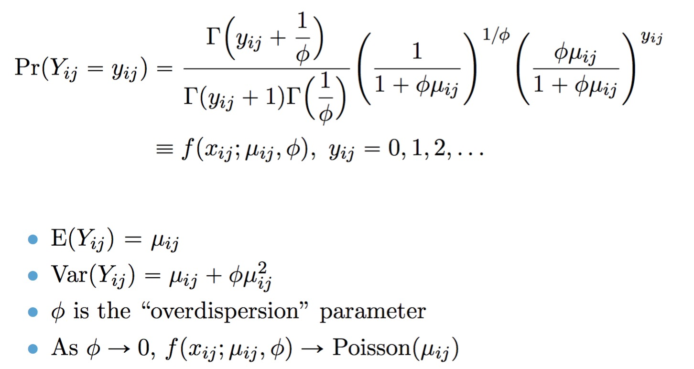

# twosigma (TWO-component SInGle cell Model-based Association method)

## Introduction

<code>twosigma</code> is an R package for fitting our proposed TWO-component SInGle cell Model-based Association method for the analysis of single-cell RNA-seq (scRNA-seq) data.  The first component models the drop-out probability with a mixed effects logistic regression, and the second component models the (conditional) mean read count with a mixed-effects log-linear negative binomial regression. Our approach is novel in that it simultaneously allows for overdispersed and zero-inflated counts while accommodating dependency in both drop-out probability and mean mRNA abundance at the single-cell level.  

## Installation
We recommend installing from Github for the latest version of the code:
```r
install.packages("devtools")
devtools::install_github("edvanburen/twosigma")
library(twosigma)
```

## Model
TWO-SIGMA is based on the following parameterization of the negative binomial distribution: 


A point mass at zero is added to the distribution to account for dropout.  The result is the probability mass function for the zero-inflated negative binomial distribution:


The full TWO-SIGMA specification is therefore as follows:


## Usage  
The workhorse function is twosigma, which can be easiest called as
```r
twosigma(count, mean_covar, zi_covar, mean_re = TRUE, zi_re = TRUE, id)
```

- **count**: A vector of non-negative integer counts. No normalization is done.
- **mean_covar**: A matrix (such as from model.matrix) of covariates for the (conditional) mean model without an intercept term. Columns give covariates and rows give individual-level information. Can be NULL if using the mean_form parameter described below.
- **zi_covar**: A matrix (such as from model.matrix) of covariates for the zero-inflation model without an intercept term. Columns give covariates and rows give individual-level information. Can be NULL if using the zi_form parameter described below.
- **mean_re**: Should random intercept terms be included in the (conditional) mean model?
- **zi_re**: Should random intercept terms be included in the zero-inflation model?
- **id**: Vector of individual-level ID's. Used for random effect prediction.

If (and likely only needed if) users wish to customize the random effect specification, they may do so via the arguments "mean_form" and "zi_form" described below:

- **mean_form** a two-sided formula for the (conditional) mean model. Left side specifies the response and right side includes fixed and random effect terms 
- **zi_form** a one-sided formula for the zero-inflation model including fixed and random effect terms

Some care must be taken, however, because these are fed directly into the glmmTMB function. **It is therefore the user's responsibility to ensure that covariates and the response specified in formula terms will match the mean_covar and zi_covar arguments, respectively**. The formulas will be fed into glmmTMB verbatium so users must ensure consistency. 

For example, each of the following function calls reproduces the default TWO-SIGMA specification with random intercepts in both components:

```r
twosigma(count=counts, mean_covar=mean_covars, zi_covar=zi_covars, mean_re = TRUE, zi_re = TRUE, id=id)
twosigma(count=counts, id=id
        , mean_form=count~mean_covars+(1|id),zi_form=~zi_covars+(1|id))
```
## Fixed Effect Testing  
If users wish to jointly test a fixed effect using the twosigma model, they may do so using the lr.twosigma function
```r
lr.twosigma(count, mean_covar, zi_covar, contrast, mean_re = TRUE,
  zi_re = TRUE, disp_covar = NULL)
```
- **contrast**: Either a string indicating the column name of the covariate to test or an integer referring to its column position in BOTH the mean_covar and zi_covar matrices. If an integer is specified there is no check that it corresponds to the same covariate in both the mean_covar and zi_covar matrices. 

This function assumes that the variable being tested is in both components of the model (and thus that the zero-inflation component exists and contains more than an Intercept). Users wishing to do fixed effect testing in other cases will need to construct the statistics themselves to ensure valid nested models are being constructed.

## Ad hoc method
As mentioned in the paper, we mention a method that can be useful in selecting genes that may benefit from the inclusion of random effect terms. This method fits a zero-inflated negative binomial model without random effects and uses a one-way ANOVA regressing the Pearson residuals on the individual ID to look for differences between individuals.

```r
adhoc.twosigma(count, mean_covar, zi_covar, id)
```
The p-value from the ANOVA F test is returned, and can be used as a screening for genes that are most in need of random effects.

## Examples
```r

#-----------------Simulate data-----------------#


#Set parameters for the simulation
nind<-25
ncellsper<-rep(500,nind)
sigma.a<-.1
sigma.b<-.1
alpha<-c(1,0,-.5,-2)
beta<-c(2,0,-.1,.6)
phi<-.1
id.levels<-1:nind


# Simulate some individual level covariates as well as cell-level Cellular Detection Rate (CDR)
t2d_ind<-rbinom(nind,1,p=.4)
t2d_sim<-rep(t2d_ind,times=ncellsper)
nind<-length(id.levels)
id<-rep(id.levels,times=ncellsper)
cdr_sim<-rbeta(sum(ncellsper),3,6) #Is this good distn
age_sim_ind<-sample(c(20:60),size=nind,replace = TRUE)
age_sim<-rep(age_sim_ind,times=ncellsper)

#Construct design matrices
Z<-cbind(scale(t2d_sim),scale(age_sim),scale(cdr_sim))
colnames(Z)<-c("t2d_sim","age_sim","cdr_sim")
X<-cbind(scale(t2d_sim),scale(age_sim),scale(cdr_sim))
colnames(X)<-c("t2d_sim","age_sim","cdr_sim")

sim_dat<-simulate_zero_inflated_nb_random_effect_data(ncellsper,X,Z,alpha,beta,phi,sigma.a,sigma.b,
                                                      id.levels=NULL,sim.seed)
#-----------------------------------------------#    

#--- Fit TWO-SIGMA to simulated data
id<-sim_dat$id
counts<-sim_dat$Y

fit<-twosigma(count=counts,zi_covar=Z,mean_covar = X,id=id)
fit_noZI<-twosigma(count=counts,zi_covar=0,mean_covar = X,id=id)
fit_meanZI<-twosigma(count=counts,zi_covar=1,mean_covar = X,id=id)
summary(fit)
confint(fit)
summary(fit_noZI)
summary(fit_meanZI)

# Perform Likelihood Ratio Test on variable "t2d_sim"
          
lr.fit<-lr.twosigma(contrast="t2d_sim",count=count,mean_covar = X,zi_covar=Z,id=id)
lr.fit$p.val

```
